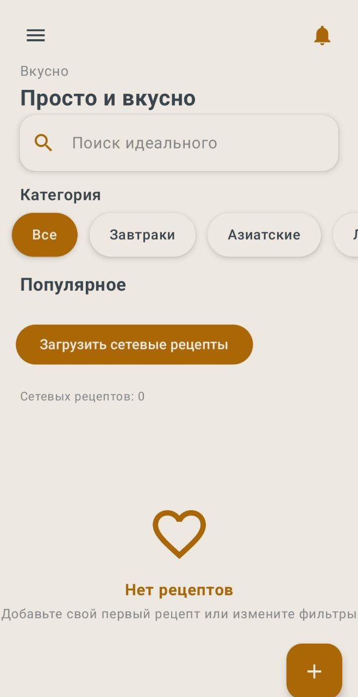
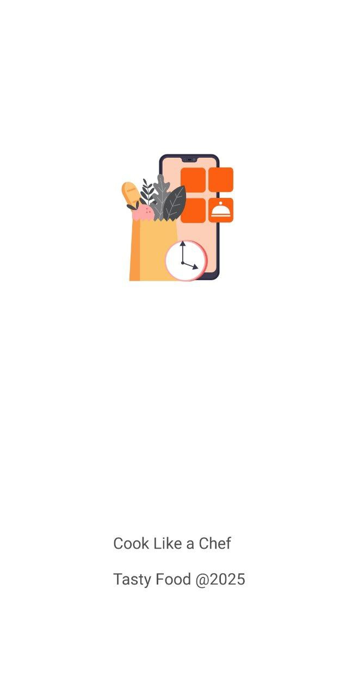
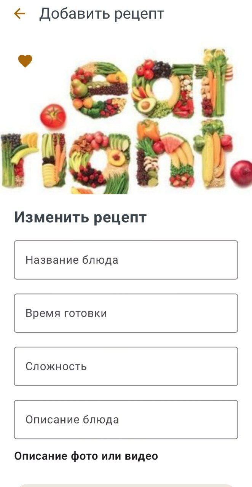
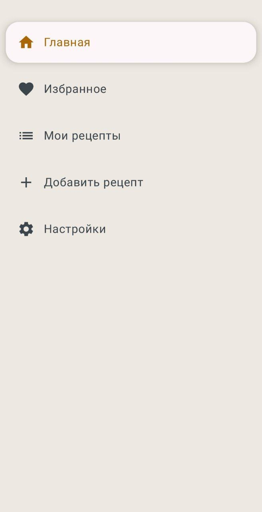
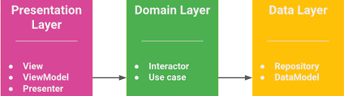
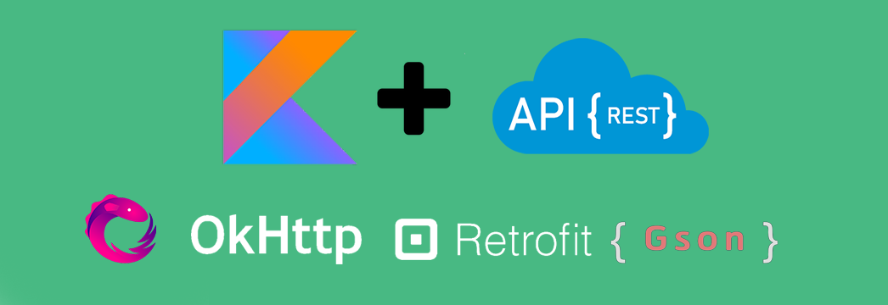
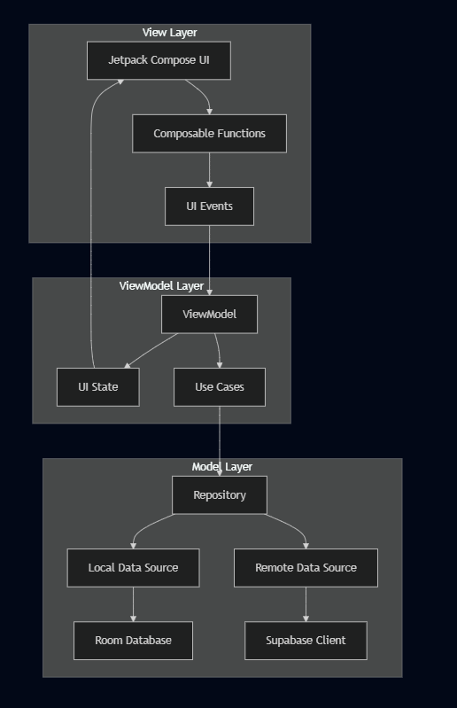

**🧑‍🍳 Cooking App**
Современное мобильное приложения для любителей готовки с функцией добавления собственных рецептов.

## 📱 Описание
TastyFood - это удобное Android-приложение, созданное в качестве финального проекта для любителей кулинарии. Оно предлагает вкусные рецепты на любой случай. Приложение помогает пользователям легко находить блюда по названию, сохранять любимые рецепты и добавлять свои. 
Готовьте с удовольствием вместе с TastyFood!

## 🌟 Ключевые особенности:

- **Интуитивный интерфейс** с Material Design 3
    
- **Поиск рецепта по названию** с синхронизацией в облаке
    
- **Добавление своего** рецепта
    
- **Лента** с рецептами
    
## 📸 Скриншоты

<table> <tr> <td align="center"> <br/> <b>Создание записи</b><br/> Экран бронирования с информацией об услуге, мастере и времени </td> <td align="center"> <br/> <b>Главный экран</b><br/> Персонализированное приветствие и каталог услуг </td> <td align="center"> <br/> <b>Промо-экран</b><br/> Реклама специальных предложений и терапии волос </td> </tr> <tr> <td align="center"> <br/> <b>Календарь бронирования</b><br/> Выбор даты и времени для записи </td> <td align="center"> <br/> <b>Портфолио</b><br/> Полный список услуг с фильтрацией </td> <td align="center"> <br/> <b>Лента работ Instagram</b><br/> Информация о мастере, рейтинг и отзывы </td> </tr> </table>

## 🛠 Используемые технологии

## **UX & UI**

- **Jetpack Compose** - современный UI toolkit для Android
    
- **Material Design 3** - дизайн-система с поддержкой динамических цветов
    
- **Navigation Compose** - типобезопасная навигация
    
- **Coil** - загрузка и кэширование изображений

  

  ## **Архитектура & Управление состоянием**

- **MVVM + Clean Architecture** - разделение ответственности
    
- **Hilt** - dependency injection используется для упрощения настройки внедрения зависимостей
    
- **Coroutines & Flow** - асинхронное программирование и подгрузка данных в фоне
    
- **StateFlow** - управление состоянием при отображение UI

## **База данных**

- **Room Database** - для локального хранения данных
    
- **Supabase** - облачная база данных с real-time синхронизацией (кэширование и синхронизация записей и услуг)
    
- **Supabase Auth** - простая для интеграции аутентификация пользователей
    


## **Дополнительные библиотеки**

- **Retrofit** - HTTP клиент
    
- **OkHttp**  **Gson** - сетевое взаимодействие
    
- **Material Icons Extended** - система иконок
    
## ⚙️ Настройка и установка

## **Минимальные требования**

Для сборки потребуется:

- Android SDK API Level 29
    
- Kotlin  2.1.21
    
- JDK 11

На самих устройствах должен быть установлен **Android 10** и выше
'
## 🎯 Функционал

✅ Готово
🕛 В процессе
📤Планируется
## **👤 Управление пользователями**
- 📤 Регистрация и авторизация 
    
- 🕛 Персонализированный профиль пользователя 
    
- ✅ Добавление своих рецептов
    
- ✅ Добавление в избранное

  ## **📱 Дополнительные функции**
- 🕛 Темная тема

- 📤 Продуктовая корзина

- 📤 Список покупок

- 📤 Лента обсуждений

  ## 🏗 Архитектура


## **MVVM + Clean Architecture**
Приложение использует **MVVM (Model-View-ViewModel)** паттерн в сочетании с принципами **Clean Architecture** для обеспечения разделения ответственности и высокой тестируемости.

```android
📦 Presentation Layer (UI)
├── 🖥️ Composables (Jetpack Compose UI)
├── 🎯 ViewModels (UI State Management)
└── 🧭 Navigation (Screen Navigation)

📦 Domain Layer (Business Logic)
├── 🎯 Use Cases (Business Operations)
├── 📋 Entities (Domain Models)
└── 🔌 Repository Interfaces

📦 Data Layer (Data Management)
├── 🗄️ Repositories (Data Sources Orchestration)
├── 💾 Local DataSource (Room Database)
├── ☁️ Remote DataSource (Supabase)
└── 🔄 Synchronization (Offline-First)

```

## **Почему именно MVVM архитектура?**

**MVVM** (Model-View-ViewModel) — архитектурный паттерн, который помогает отделить логику представления от бизнес-логики и взаимодействия с данными. Этот паттерн стал стандартом для Android-приложений благодаря поддержке от Google и хорошей интеграции с компонентами Android Architecture Components.

1. **Разделение ответственности** - каждый слой имеет четкую роль
    
2. **Тестируемость** - легко создавать unit и integration тесты
    
3. **Масштабируемость** - простое добавление новых функций
    
4. **Maintenance** - изолированные изменения без влияния на другие слои
    
5. **Offline-First** - приложение работает без интернета
    
## **🗂️ Дополнительные файлы**

📝**Отчет по проекту** 
![[.docx]]

🗃️**Презентация**


🗣️ **Выступление для защиты проекта**
[Выступление tastyfood.docx](Выступление tastyfood.docx) 

## 👨‍💻 Авторы

**Матвеева Ульяна** Студент 1
    
- 🐱 GitHub: [@Uliana-M](https://github.com/Uliana-M)
    
- 📱 Telegram: [@Niko_andtheniners]
    
**Горчакова Софья** Студент 2 
    
- 📱 Telegram: [@sonechka3020]

  **Семенова Вероника** Студент 3 
    
- 📱 Telegram: [@]

  **Суринова Ангелина** Студент 4
    
- 📱 Telegram: [@Yakutyanochka9]


